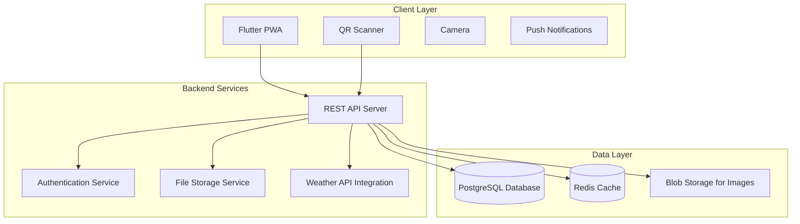

# Design Document

## Overview

Flutter PWA приложение за каталогизиране на растения и управление на градини. Системата следва B2B2C модел, където ландшафтните архитекти създават и управляват профили за своите клиенти. Приложението работи като Progressive Web App с офлайн възможности и push нотификации.

## Architecture

### High-Level Architecture



### Technology Stack

**Frontend (Flutter PWA):**
- Flutter 3.x with web support
- PWA capabilities (service worker, offline storage)
- QR code scanner (qr_code_scanner package)
- Local storage (shared_preferences, hive)
- Push notifications (firebase_messaging)
- Image handling (image_picker, cached_network_image)

**Backend:**
- Node.js with Express.js или Python with FastAPI
- PostgreSQL за основна база данни
- Redis за кеширане
- AWS S3/CloudFlare R2 за съхранение на снимки
- Weather API интеграция (OpenWeatherMap)

**Infrastructure:**
- Docker контейнери
- Cloud deployment (AWS/DigitalOcean)
- CDN за статични файлове

## Components and Interfaces

### Core Components

#### 1. Plant Catalog Service
```dart
class PlantCatalogService {
  Future<List<Plant>> getPlantsByCategory(PlantCategory category);
  Future<Plant> getPlantById(String id);
  Future<List<Plant>> searchPlants(SearchCriteria criteria);
  Future<List<Plant>> getCompatiblePlants(String plantId);
  Future<void> cachePlantsOffline();
}
```

#### 2. QR Code Service
```dart
class QRCodeService {
  Future<Plant?> scanPlantQR();
  Future<String> generatePlantQR(String plantId);
  Future<void> shareQRCode(String plantId);
}
```

#### 3. Garden Management Service
```dart
class GardenService {
  Future<ClientGarden> getClientGarden(String clientId);
  Future<void> addPlantToGarden(String clientId, PlantInstance plant);
  Future<List<PlantInstance>> getGardenPlants(String clientId);
  Future<void> updatePlantStatus(String plantInstanceId, PlantStatus status);
  Future<void> addGardenNote(String clientId, GardenNote note);
}
```

#### 4. Care Reminder Service
```dart
class CareReminderService {
  Future<List<CareReminder>> getActiveReminders(String clientId);
  Future<void> scheduleReminder(CareReminder reminder);
  Future<void> markReminderComplete(String reminderId);
  Future<void> postponeReminder(String reminderId, Duration delay);
  Future<void> updateRemindersForWeather(WeatherData weather);
}
```

#### 5. Admin Panel Service
```dart
class AdminService {
  Future<void> createClientProfile(ClientProfile profile);
  Future<void> addPlantToCatalog(Plant plant);
  Future<void> bulkImportPlants(List<PlantData> plants);
  Future<void> uploadGardenMasterPlan(String clientId, File planFile);
  Future<void> assignPlantsToClient(String clientId, List<String> plantIds);
}
```

### Data Models

#### Plant Model
```dart
class Plant {
  final String id;
  final String latinName;
  final String bulgarianName;
  final PlantCategory category;
  final List<String> imageUrls;
  final PlantCharacteristics characteristics;
  final CareRequirements careRequirements;
  final PlantSpecifications specifications;
  final List<String> compatiblePlantIds;
  final ToxicityInfo toxicity;
  final PriceCategory priceCategory;
  final String qrCode;
}

class PlantCharacteristics {
  final String description;
  final LightRequirement lightRequirement;
  final WaterRequirement waterRequirement;
  final SoilType preferredSoil;
  final int hardinessZone;
}

class CareRequirements {
  final WateringSchedule watering;
  final FertilizingSchedule fertilizing;
  final PruningSchedule pruning;
  final List<SeasonalCare> seasonalCare;
}
```

#### Client Garden Model
```dart
class ClientGarden {
  final String clientId;
  final ClientProfile profile;
  final GardenMasterPlan masterPlan;
  final List<GardenZone> zones;
  final List<PlantInstance> plants;
  final List<GardenNote> notes;
  final List<GardenDocument> documents;
}

class PlantInstance {
  final String id;
  final String plantId;
  final String zoneId;
  final DateTime plantedDate;
  final PlantSize plantedSize;
  final PlantStatus status;
  final List<String> progressPhotos;
  final List<CareRecord> careHistory;
}
```

#### Care Reminder Model
```dart
class CareReminder {
  final String id;
  final String clientId;
  final String plantInstanceId;
  final CareType careType;
  final DateTime scheduledDate;
  final ReminderFrequency frequency;
  final String instructions;
  final bool isCompleted;
  final WeatherDependency weatherDependency;
}
```

## Data Models

### Database Schema

#### Plants Table
```sql
CREATE TABLE plants (
    id UUID PRIMARY KEY DEFAULT gen_random_uuid(),
    latin_name VARCHAR(255) NOT NULL,
    bulgarian_name VARCHAR(255) NOT NULL,
    category plant_category_enum NOT NULL,
    description TEXT,
    light_requirement light_enum NOT NULL,
    water_requirement water_enum NOT NULL,
    soil_type soil_enum,
    hardiness_zone INTEGER,
    max_height_cm INTEGER,
    max_width_cm INTEGER,
    bloom_season season_enum[],
    growth_rate growth_rate_enum,
    toxicity_level toxicity_enum,
    price_category price_enum,
    qr_code VARCHAR(255) UNIQUE,
    created_at TIMESTAMP DEFAULT NOW(),
    updated_at TIMESTAMP DEFAULT NOW()
);
```

#### Client Gardens Table
```sql
CREATE TABLE client_gardens (
    id UUID PRIMARY KEY DEFAULT gen_random_uuid(),
    client_id UUID NOT NULL,
    garden_name VARCHAR(255),
    master_plan_url VARCHAR(500),
    zones JSONB,
    created_by UUID NOT NULL, -- landscape team member
    created_at TIMESTAMP DEFAULT NOW(),
    updated_at TIMESTAMP DEFAULT NOW()
);
```

#### Plant Instances Table
```sql
CREATE TABLE plant_instances (
    id UUID PRIMARY KEY DEFAULT gen_random_uuid(),
    garden_id UUID REFERENCES client_gardens(id),
    plant_id UUID REFERENCES plants(id),
    zone_id VARCHAR(100),
    planted_date DATE,
    planted_size plant_size_enum,
    status plant_status_enum DEFAULT 'planted',
    progress_photos TEXT[],
    notes TEXT,
    created_at TIMESTAMP DEFAULT NOW(),
    updated_at TIMESTAMP DEFAULT NOW()
);
```

#### Care Reminders Table
```sql
CREATE TABLE care_reminders (
    id UUID PRIMARY KEY DEFAULT gen_random_uuid(),
    client_id UUID NOT NULL,
    plant_instance_id UUID REFERENCES plant_instances(id),
    care_type care_type_enum NOT NULL,
    scheduled_date TIMESTAMP NOT NULL,
    frequency_days INTEGER,
    instructions TEXT,
    is_completed BOOLEAN DEFAULT FALSE,
    weather_dependent BOOLEAN DEFAULT FALSE,
    completed_at TIMESTAMP,
    created_at TIMESTAMP DEFAULT NOW()
);
```

### Offline Data Strategy

**Critical Data for Offline Access:**
- Plant catalog (основна информация)
- Client's garden plants
- Active care reminders
- Recently viewed plants

**Sync Strategy:**
- Background sync при връзка с интернет
- Incremental updates
- Conflict resolution за user-generated content

## Correctness Properties

*A property is a characteristic or behavior that should hold true across all valid executions of a system-essentially, a formal statement about what the system should do. Properties serve as the bridge between human-readable specifications and machine-verifiable correctness guarantees.*

### Property 1: Plant Categorization Integrity
*For any* plant stored in the catalog, when retrieved by category, it should belong to the specified category and all plants in a category should be retrievable by that category.
**Validates: Requirements 1.1**

### Property 2: Plant Data Completeness
*For any* plant added to the catalog, it should contain all required fields (Latin name, Bulgarian name, characteristics, care requirements, specifications, compatibility info, toxicity warnings) and multiple categorized photos.
**Validates: Requirements 1.2, 1.3, 1.4, 1.5, 1.6**

### Property 3: QR Code Uniqueness and Round-trip
*For any* plant in the catalog, its QR code should be unique across all plants, and scanning the QR code should return the complete original plant information.
**Validates: Requirements 2.1, 2.2**

### Property 4: QR Code Functionality Completeness
*For any* QR code scan result, it should provide options to add the plant to "My Garden" and share plant information.
**Validates: Requirements 2.3, 2.4**

### Property 5: Plant Compatibility Logic
*For any* two plants suggested as compatible, they should have compatible light requirements, water needs, and complementary color/height/seasonal characteristics.
**Validates: Requirements 3.1, 3.2, 3.3, 3.4**

### Property 6: Compatibility Visualization
*For any* plant combination, the system should provide visual representation of the combination.
**Validates: Requirements 3.5**

### Property 7: Client Profile Uniqueness
*For any* client profile created by the landscape team, it should have unique login credentials and include pre-populated plants from the associated project.
**Validates: Requirements 4.1, 4.2**

### Property 8: Garden Data Persistence
*For any* client garden, it should maintain complete planting history with dates and photos, allow addition of personal notes and photos, and store all documentation types.
**Validates: Requirements 4.3, 4.4, 4.5, 4.6**

### Property 9: Care Reminder Intelligence
*For any* plant in a client garden, the care reminder system should generate appropriate reminders based on plant type, age, season, and weather conditions, covering all care types (watering, fertilizing, pruning, seasonal care).
**Validates: Requirements 5.1, 5.2, 5.3, 5.4, 5.5**

### Property 10: Reminder User Interaction
*For any* care reminder, users should be able to postpone it or mark it as completed, and these state changes should persist correctly.
**Validates: Requirements 5.6**

### Property 11: Admin Plant Management
*For any* admin operation (creating profiles, adding/editing plants, bulk imports), the operation should complete successfully and data should persist correctly with proper validation.
**Validates: Requirements 6.1, 6.2, 6.4, 6.5**

### Property 12: File Upload and Processing
*For any* file upload operation (QR labels, plant photos, master plans), files should be successfully stored and properly associated with their target entities, supporting multiple file formats where specified.
**Validates: Requirements 6.3, 6.6, 7.1**

### Property 13: Garden Zone Management
*For any* garden master plan, zones should be definable with legends, renameable according to project needs, and should correctly display assigned plants when viewed.
**Validates: Requirements 7.2, 7.3, 7.4, 7.5**

### Property 14: Search and Filter Accuracy
*For any* search or filter operation on the plant catalog, results should accurately match the specified criteria (name, category, characteristics, care requirements, specifications) and display complete information with photos, including support for complex multi-criteria searches.
**Validates: Requirements 8.1, 8.2, 8.3, 8.4, 8.5**

## Error Handling

### Input Validation
- **Plant Data Validation**: Validate all required fields, image formats, and data constraints
- **QR Code Validation**: Ensure QR codes are properly formatted and unique
- **File Upload Validation**: Validate file types, sizes, and formats for images and master plans
- **User Input Sanitization**: Sanitize all user inputs to prevent injection attacks

### Network Error Handling
- **Offline Mode**: Graceful degradation when network is unavailable
- **Sync Conflicts**: Handle conflicts when offline data syncs with server
- **API Timeouts**: Retry logic with exponential backoff
- **Image Loading Failures**: Fallback to placeholder images

### Data Integrity
- **Database Constraints**: Foreign key constraints and data validation at DB level
- **Transaction Management**: Ensure data consistency during complex operations
- **Backup and Recovery**: Regular backups with point-in-time recovery
- **Audit Logging**: Track all data modifications for accountability

### User Experience
- **Loading States**: Show progress indicators for long operations
- **Error Messages**: User-friendly error messages in Bulgarian
- **Retry Mechanisms**: Allow users to retry failed operations
- **Graceful Failures**: Partial functionality when some services are unavailable

## Testing Strategy

### Dual Testing Approach
The system will use both unit tests and property-based tests to ensure comprehensive coverage:

- **Unit tests**: Verify specific examples, edge cases, and error conditions
- **Property tests**: Verify universal properties across all inputs using randomized testing
- Both approaches are complementary and necessary for comprehensive validation

### Property-Based Testing Configuration
- **Testing Framework**: Use `flutter_test` with `test` package for Dart/Flutter
- **Property Testing Library**: Use `test` package with custom property generators
- **Test Iterations**: Minimum 100 iterations per property test
- **Test Tagging**: Each property test tagged with format: **Feature: landscape-plant-catalog, Property {number}: {property_text}**

### Unit Testing Focus Areas
- **Specific Examples**: Test concrete scenarios like adding specific plants, scanning known QR codes
- **Edge Cases**: Empty catalogs, invalid QR codes, network failures, large file uploads
- **Integration Points**: API communication, database operations, file storage
- **Error Conditions**: Invalid inputs, network timeouts, storage failures

### Property Testing Focus Areas
- **Universal Properties**: Test properties that should hold for all valid inputs
- **Data Consistency**: Ensure data integrity across all operations
- **Business Logic**: Validate compatibility algorithms, reminder scheduling logic
- **Input Coverage**: Test with wide range of randomized valid inputs

### Testing Implementation Requirements
- Each correctness property must be implemented as a single property-based test
- Property tests must reference their corresponding design document property
- Unit tests should focus on specific examples and integration scenarios
- All tests must achieve passing status before feature completion
- Test failures must be triaged to determine if the issue is in code, test, or specification